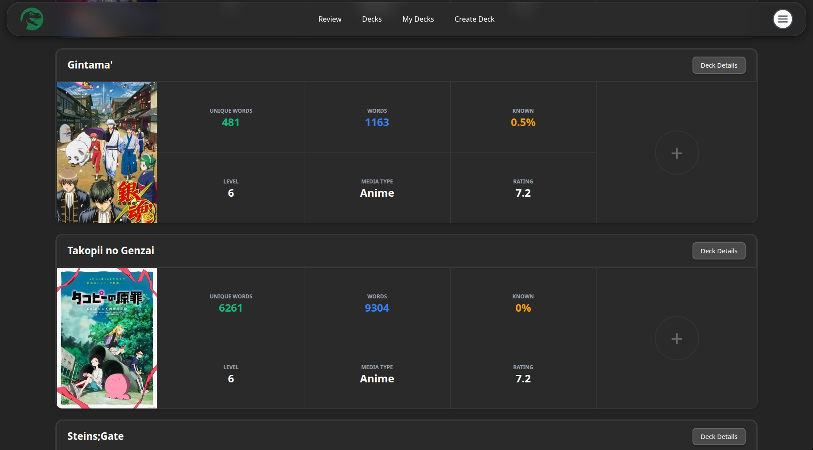
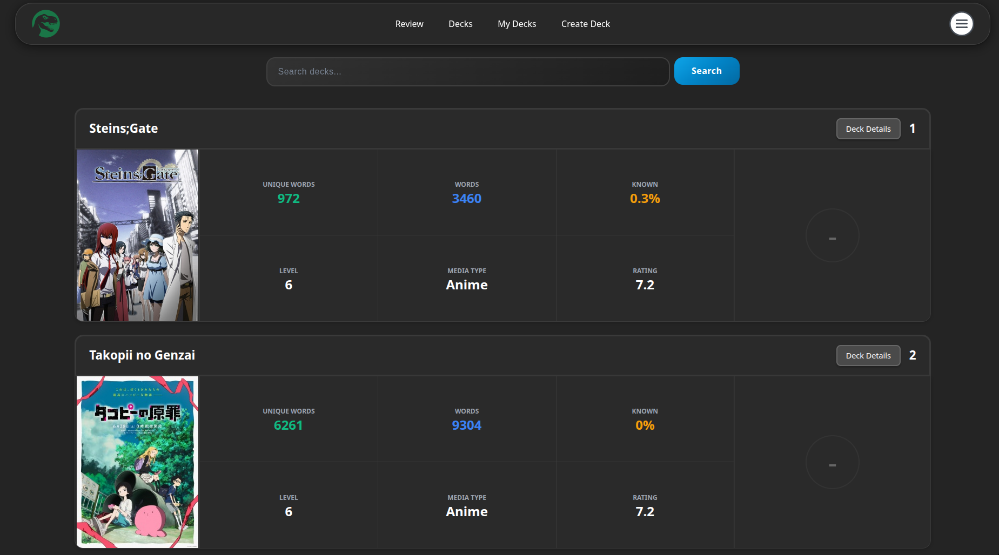
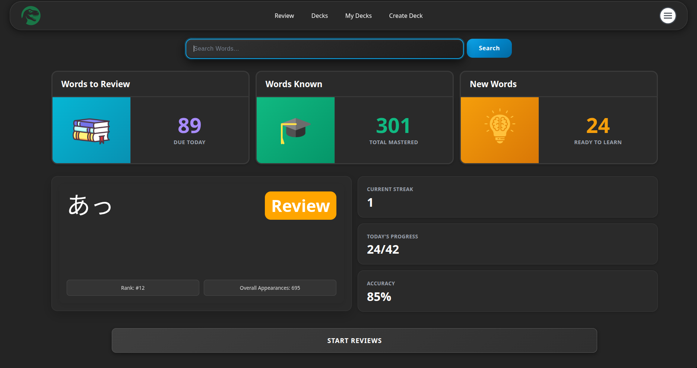
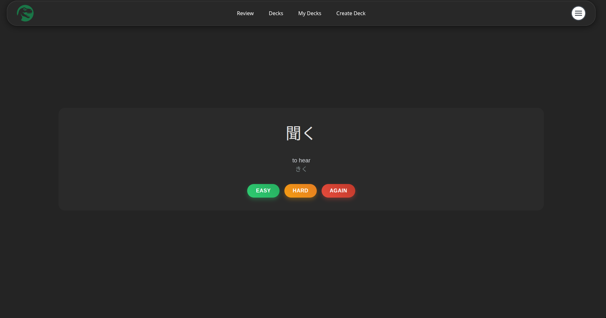

# Blamph

Japanese learning application to assist learners in immersing in their chosen media through spaced repition (SRS).

[Access the app here](https://blamph.vercel.app/) (Backend no longer deployed as I ran out of free AWS credits)

## Features

- Users can choose from a range of decks which contain all the words from a given media (anime, light novel etc.)

- After adding a deck, it appears in the My Decks page, the first deck on your decks page will be the active source of your SRS reviews (similar to Anki).

- Now you can go to the review page and start learning new words, and reviewing previously studied ones.

- As of now, the site functions similar to other SRS sites like Anki, but with streamlined decks catered to specific media.

## Functionality

The decks page allows you to search and add decks to your decks. Click the + button to 
add your desired deck and this will appear in my decks.

The my decks page consists of your selected decks. The next word that you will learn will depend on the
deck you have in your number 1 slot, and the algorithm you choose in settings for new words.

This is where you can see your review stats and begin review new words by clicking the 'START REVIEWS' button.

Finally these are your SRS reviews where previously studied cards and new cards will appear.

## Tech Stack

- Frontend: React / CSS (Deployed on Vercel)

- Backend: Python / FastAPI with SQLAlchemy ORM (Deployed on AWS EC2)

- Database: PostgreSQL (Deployed on AWS RDS)

- SRS operates on the FSRS algorithm (Same as anki)

## License

MIT
